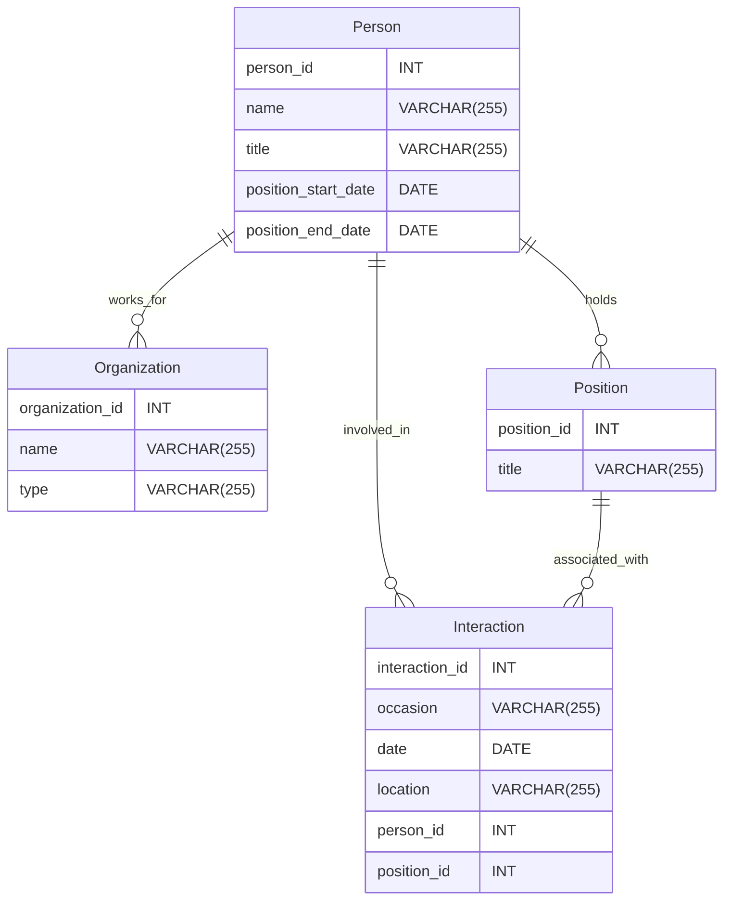

```mermaid
erDiagram
    Person {
        person_id INT
        name VARCHAR(255)
        title VARCHAR(255)
        position_start_date DATE
        position_end_date DATE
    }
    Organization {
        organization_id INT
        name VARCHAR(255)
        type VARCHAR(255)
    }
    Position {
        position_id INT
        title VARCHAR(255)
    }
    Interaction {
        interaction_id INT
        occasion VARCHAR(255)
        date DATE
        location VARCHAR(255)
        person_id INT
        position_id INT
    }

    Person ||--o{ Organization : works_for
    Person ||--o{ Position : holds
    Person ||--o{ Interaction : involved_in
    Position ||--o{ Interaction : associated_with
```
